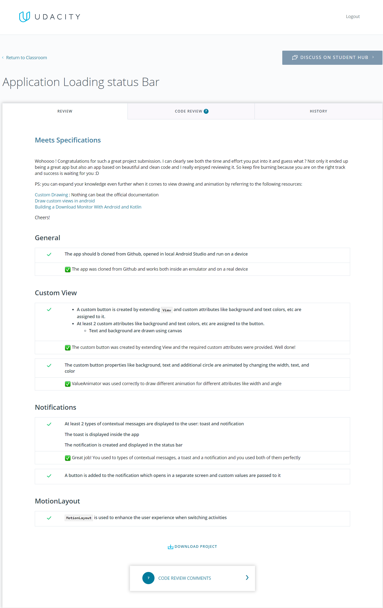
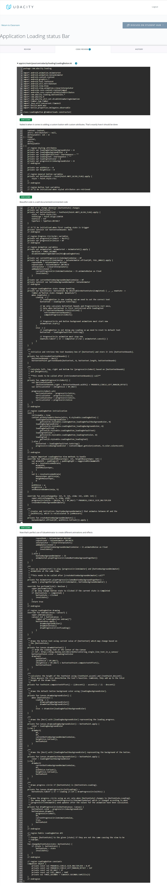
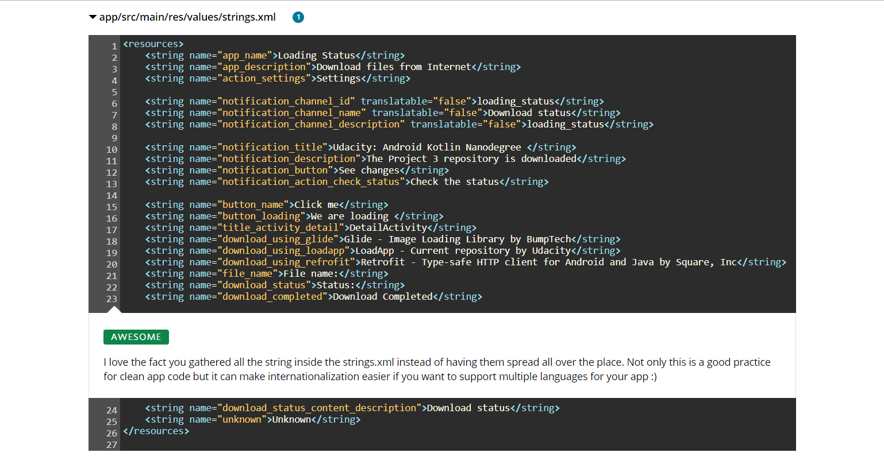
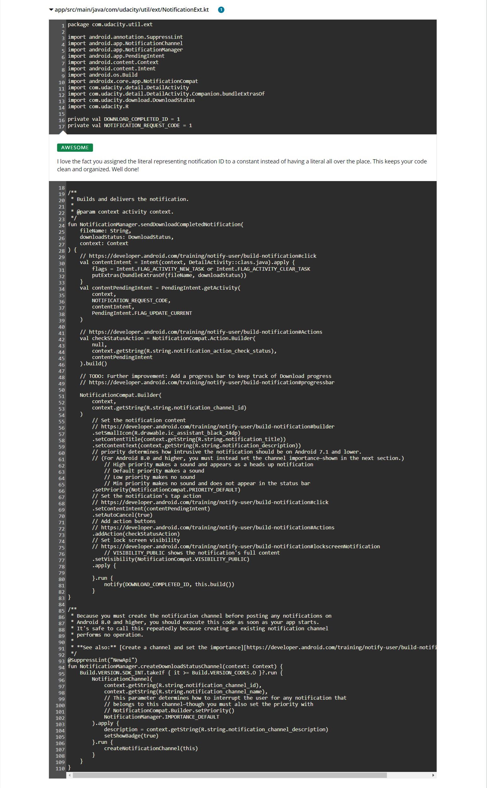
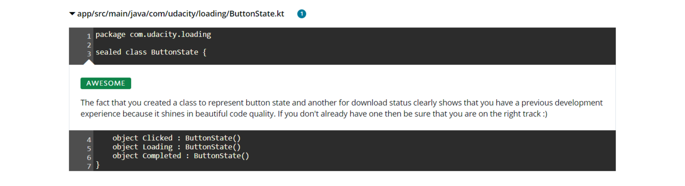
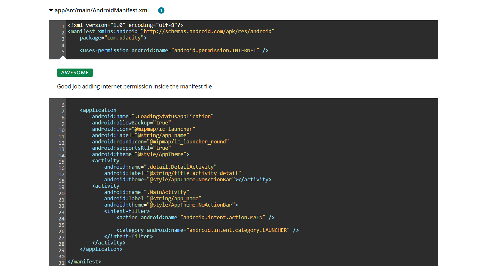

# Loading status Bar App Project

## Project Overview

Loading status Bar app is the third project in the [Android Kotlin Nanodegree Program](https://www.udacity.com/course/android-kotlin-developer-nanodegree--nd940) from Udacity. It showcases primarily how to create a [custom View](https://developer.android.com/guide/topics/ui/custom-components) for Android using Kotlin language.

Also it showcases how to add awesome animations with [Property Animation](https://developer.android.com/guide/topics/graphics/prop-animation) system using APIs such as `ValueAnimator`, `ObjectAnimator` and `AnimatorSet`.

Also it showcases how to use (MotionLayout)[https://developer.android.com/training/constraint-layout/motionlayout] to [help make a UI expressive and easy to use](https://material.io/design/motion/understanding-motion.html).

Also it showcases how to properly communicate with user through [Notificatinos](https://developer.android.com/training/notify-user/build-notification) including APIs for newer Android versions also mantaining compatibility with prior versions.

## Project Specification

### General

| CRITERIA       | MEETS SPECIFICATIONS |
| :------------- | :---------- |
| Code compiles and runs without errors. | The app should b cloned from Github, opened in local Android Studio and run on a device |

### Custom View

| CRITERIA       | MEETS SPECIFICATIONS |
| :------------- | :---------- |
| Customize and display of information using canvas with desired color and style | <ul><li>A custom button is created by extending `View` and custom attributes like background and text colors, etc are assigned to it.</li><li>At least 2 custom attributes like background and text colors, etc are assigned to the button.<ul><li>Text and background are drawn using canvas</li></ul></li></ul> |
| Animate UI elements with property animations to provide users with visual feedback in an Android app | The custom button properties like background, text and additional circle are animated by changing the width, text, and color |

### Notifications

| CRITERIA       | MEETS SPECIFICATIONS |
| :------------- | :---------- |
| Send contextual messages using notifications to keep users informed | 
At least 2 types of contextual messages are displayed to the user: toast and notification

The toast is displayed inside the app

The notification is created and displayed in the status bar
 |
| Add custom functionality to the notifications | A button is added to the notification which opens in a separate screen and custom values are passed to it |

### MotionLayout

| CRITERIA       | MEETS SPECIFICATIONS |
| :------------- | :---------- |
| Use declarative XML with `MotionLayout` to coordinate animations across multiple views | `MotionLayout` is used to enhance the user experience when switching activities |

## Showcase

    

## Live Running

## Project reviews

- [Review #1](https://review.udacity.com/?utm_campaign=ret_000_auto_ndxxx_submission-reviewed&utm_source=blueshift&utm_medium=email&utm_content=reviewsapp-submission-reviewed&bsft_clkid=e4734692-7707-4e96-8d35-aba38b6b8b4f&bsft_uid=41fbbe1d-caad-4775-b74e-f4848e660feb&bsft_mid=ff5a8443-3050-4e0e-b861-6cbe936e358b&bsft_eid=6f154690-7543-4582-9be7-e397af208dbd&bsft_txnid=38b51cf8-d934-47a6-b74f-c3d4448345f3&bsft_link_id=2&bsft_mime_type=html&bsft_ek=2021-03-04T01%3A10%3A14Z&bsft_aaid=8d7e276e-4a10-41b2-8868-423fe96dd6b2&bsft_lx=2&bsft_tv=5#!/reviews/2792240)

### Code Review

    

Source code: [LoadingButton.kt](https://github.com/filipebezerra/loading-status-bar-app-android-kotlin/blob/main/app/src/main/java/com/udacity/loading/LoadingButton.kt)

    

Source code: [strings.xml](https://github.com/filipebezerra/loading-status-bar-app-android-kotlin/blob/main/app/src/main/res/values/strings.xml)

    

Source code: [NotificationExt.kt](https://github.com/filipebezerra/loading-status-bar-app-android-kotlin/blob/main/app/src/main/java/com/udacity/util/ext/NotificationExt.kt)

    

Source code: [ButtonState.kt](https://github.com/filipebezerra/loading-status-bar-app-android-kotlin/blob/main/app/src/main/java/com/udacity/loading/ButtonState.kt)

    

Source code: [AndroidManifest.xml](https://github.com/filipebezerra/loading-status-bar-app-android-kotlin/blob/main/app/src/main/AndroidManifest.xml)

## Libraries Used

- [Jetpack Foundation](https://developer.android.com/jetpack/components) - Components for core system capabilities, Kotlin extensions and support for multidex and automated testing.
    - [AppCompat](https://developer.android.com/topic/libraries/support-library/packages#v7-appcompat) - Degrade gracefully on older versions of Android.
    - [Android KTX](https://developer.android.com/kotlin/ktx) - Write more concise, idiomatic Kotlin code.
- [Architecture](https://developer.android.com/jetpack/arch/) - A collection of libraries that help you design robust, testable, and maintainable apps. Start with classes for managing your UI component lifecycle and handling data persistence.
    - [Data Binding](https://developer.android.com/topic/libraries/data-binding/) - Declaratively bind observable data to UI elements.
    - [Constraintlayout](https://developer.android.com/jetpack/androidx/releases/constraintlayout) - Position and size widgets in a flexible anf efficient way with relative positioning
    - [Material Components for Android](https://github.com/material-components/material-components-android) - Material Design toolkit to design and code high-quality digital experiences
- Third party and miscellaneous libraries
    - [Timber](https://github.com/JakeWharton/timber) - A logger with a small, extensible API which provides utility on top of Android's normal Log class

## Getting Started

### Built With

* [Android Studio](https://developer.android.com/studio) - Default IDE used to build android apps
* [Kotlin](https://kotlinlang.org/) - Default language used to build this project

Include all items used to build project.

To build the app, use the gradlew build command or use "Import Project" in Android Studio.

## License
Please review the following [license agreement](https://bumptech.github.io/glide/dev/open-source-licenses.html)
